## Scripts and modules in JavaScript

In the early days of JavaScript, when the language only ran in browsers, there were no modules, but it was still possible to split the JavaScript for a web page into multiple files by using multiple `script` tags in HTML:

```html
<html>
  <head>
    <script src="a.js"></script>
    <script src="b.js"></script>
  </head>
  <body></body>
</html>
```

This approach had some downsides, especially as web pages grew larger and more complex. In particular, all scripts loaded onto the same page share the same scope—appropriately called the “global scope”—meaning the scripts had to be very careful not to overwrite each others’ variables and functions.

Any system that solves this problem by giving files their own scope while still providing a way to make bits of code available to other files can be called a “module system.” (It may sound obvious to say that each file in a module system is called a “module,” but the term is often used to contrast with _script_ files, which run outside a module system, in a global scope.)

> There are [many module systems](https://github.com/myshov/history-of-javascript/tree/master/4_evolution_of_js_modularity), and TypeScript [supports emitting several](https://www.typescriptlang.org/tsconfig/#module), but this documentation will focus on the two most important systems today: ECMAScript modules (ESM) and CommonJS (CJS).
>
> ECMAScript Modules (ESM) is the module system built into the language, supported in modern browsers and in Node.js since v12. It uses dedicated `import` and `export` syntax:
>
> ```js
> // a.js
> export default "Hello from a.js";
> ```
>
> ```js
> // b.js
> import a from "./a.js";
> console.log(a); // 'Hello from a.js'
> ```
>
> CommonJS (CJS) is the module system that originally shipped in Node.js, before ESM was part of the language specification. It’s still supported in Node.js alongside ESM. It uses plain JavaScript objects and functions named `exports` and `require`:
>
> ```js
> // a.js
> exports.message = "Hello from a.js";
> ```
>
> ```js
> // b.js
> const a = require("./a");
> console.log(a.message); // 'Hello from a.js'
> ```

Accordingly, when TypeScript detects that a file is a CommonJS or ECMAScript module, it starts by assuming that file will have its own scope. Beyond that, though, the compiler’s job gets a little more complicated.

## TypeScript’s job concerning modules

The TypeScript compiler’s chief goal is to look at input code and tell the author about problems the output code might encounter at runtime. To do this, the compiler needs to know some things about the code’s intended runtime environment—what globals are available, for example. When the input code is a module, there are several additional questions the compiler needs to answer in order to do its job. Let’s use a few lines of input code as an example to think about all the information needed to analyze it:

```ts
import sayHello from "greetings";
sayHello("world");
```

To check this file, the compiler needs to know the type of `sayHello` (is it a function that can accept one string argument?), which opens quite a few additional questions:

1. What kind of module does the module system expect to find at the location where I output this file?
2. What output JavaScript code should I emit for this input?
3. When the module system loads that output code, where will it look to find the module specified by `"greetings"`? Will the lookup succeed?
4. What kind of module is the file resolved by that lookup?
5. Does the module system allow the kind of module detected in (1) to reference the kind of module detected in (4) with the syntax decided in (2)?
6. Once the `"greetings"` module has been analyzed, what piece of that module is bound to `sayHello`?

Notice that all of these questions depend on characteristics of the _host_—the system that ultimately consumes the output code to direct its module loading behavior, typically either a runtime (like Node.js) or bundler (like Webpack). The ECMAScript specification defines how ESM imports and exports match up with each other, but it doesn’t specify how the file lookup in (3), known as _module resolution_, happens, and it doesn’t say anything about other module systems like CommonJS. So runtimes and bundlers, especially those that want to support both ESM and CJS, have a lot of freedom to design their own rules. Consequently, the way TypeScript should answer the questions above can vary dramatically depending on where the code is intended to run. There’s no single right answer, so the compiler must be told the rules through configuration options.

The other key idea to keep in mind is that TypeScript always has to think about these questions in terms of its _output_ JavaScript files, not its _input_ TypeScript (or JavaScript!) files. Over the course of this document, we’ll examine a few concrete examples of where this matters. But for now, we can summarize TypeScript’s job when it comes to modules in those terms:

Understand the **rules of the host** enough

1. to compile files into a valid **output module format**,
2. to ensure that imports in those **outputs** will **resolve successfully**, and
3. to know what **type** to assign to **imported names**.

## Who is the host?

Before we move on, it’s worth making sure we’re on the same page about the term _host_, because it will come up frequently. We defined it before as “the system that ultimately consumes the output code to direct its module loading behavior.” In other words, it’s the system outside of TypeScript that TypeScript’s module analysis tries to model:

- When the output code (whether produced by `tsc` or a third-party transpiler) is run directly in a runtime like Node.js, the runtime is the host.
- When there is no “output code” because a runtime consumes TypeScript files directly, the runtime is still the host.
- When a bundler consumes TypeScript inputs or outputs and produces a bundle, the bundler is the host, because it looked at the original set of imports/requires, looked up what files they referenced, and produced a new file or set of files where the original imports and requires are erased or transformed beyond recognition. (That bundle itself might comprise modules, and the runtime that runs it will be its host, but TypeScript doesn’t know about anything that happens post-bundler.)
- If another transpiler, optimizer, or formatter runs on TypeScript’s outputs, it’s _not_ a host that TypeScript cares about, as long as it leaves the imports and exports it sees alone.
- When loading modules in a web browser, the behaviors TypeScript needs to model are actually split between the web server and the module system running in the browser. The browser’s JavaScript engine (or a script-based module-loading framework like RequireJS) controls what module formats are accepted, while the web server decides what file to send when one module triggers a request to load another.

## The module output format

In any project, the first question about modules we need to answer is what kinds of modules the host expects, so TypeScript can set its output format for each file to match. Sometimes, the host only _supports_ one kind of module—ESM in the browser, or CJS in Node.js v11 and earlier, for example. Node.js v12 and later accepts both CJS and ES modules, but uses file extensions and `package.json` files to determine what format each file should be, and throws an error if the file’s contents don’t match the expected format.

The `module` compiler option provides this information to the compiler. Its primary purpose is to control the module format of any JavaScript that gets emitted during compilation, but it also serves to inform the compiler about how the module kind of each file should be detected, how different module kinds are allowed to import each other, and whether features like `import.meta` and top-level `await` are available. So, even if a TypeScript project is using `noEmit`, choosing the right setting for `module` still matters. As we established earlier, the compiler needs an accurate understanding of the module system so it can type check (and provide IntelliSense for) imports. See [_Choosing compile options](/docs/modules/guides/choosing-compiler-options.html) for guidance on choosing the right `module` setting for your project.

The available `module` settings are

- [**`node16`**](/docs/modules/reference.html#node16-nodenext): Reflects the module system of Node.js v16+, which supports ES modules and CJS modules side-by-side with particular interoperability and detection rules.
- [**`nodenext`**](/docs/modules/reference.html#node16-nodenext): Currently identical to `node16`, but will be a moving target reflecting the latest Node.js versions as Node.js’s module system evolves.
- [**`es2015`**](/docs/modules/reference.html#es2015-es2020-es2022-esnext): Reflects the ES2015 language specification for JavaScript modules (the version that first introduced `import` and `export` to the language).
- [**`es2020`**](/docs/modules/reference.html#es2015-es2020-es2022-esnext): Adds support for `import.meta` and `export * as ns from "mod"` to `es2015`.
- [**`es2022`**](/docs/modules/reference.html#es2015-es2020-es2022-esnext): Adds support for top-level `await` to `es2020`.
- [**`esnext`**](/docs/modules/reference.html#es2015-es2020-es2022-esnext): Currently identical to `es2022`, but will be a moving target reflecting the latest ECMAScript specifications, as well as module-related Stage 3+ proposals that are expected to be included in upcoming specification versions.
- **[`commonjs`](/docs/modules/reference.html#commonjs), [`system`](/docs/modules/reference.html#system), [`amd`](/docs/modules/reference.html#amd), and [`umd`](/docs/modules/reference.html#umd)**: Each emits everything in the non-standard module system named, and assumes everything can be successfully imported into that module system. These are no longer recommended for new projects and will not be covered by this documentation.

> Node.js’s rules for module kind detection and interoperability make it incorrect to specify `module` as `esnext` or `commonjs` for projects that run in Node.js, even if all files emitted by `tsc` are ESM or CJS, respectively. The only correct `module` settings for projects that intend to run in Node.js are `node16` and `nodenext`, because these are the only settings that encode these rules. While the emitted JavaScript for an all-ESM Node.js project might look identical between compilations using `esnext` and `nodenext`, the type checking can differ. See the [reference section on `nodenext`](/docs/modules/reference.html#node16-nodenext) for more details.

### Module format detection

Node.js understands both ES modules and CJS modules, but the format of each file is determined by its file extension and the `type` field of the first `package.json` file found in a search of the file’s directory and all ancestor directories. `.mjs` and `.cjs` files are always interpreted as ES modules and CJS modules, respectively. `.js` files are interpreted as ES modules if the nearest `package.json` file contains a `type` field with the value `"module"`. If there is no `package.json` file, or if the `type` field is missing or has any other value, `.js` files are interpreted as CJS modules. If a file is determined to be an ES module by these rules, Node.js will not inject the CommonJS `module` and `require` objects into the file’s scope during evaluation, so a file that tries to use them will cause a crash. Conversely, if a file is determined to be a CJS module, `import` and `export` declarations in the file will cause a syntax error crash.

When the `module` compiler option is set to `node16` or `nodenext`, TypeScript applies this same algorithm to the project’s _input_ files to determine the module kind of each corresponding _output_ file. Let’s look at how module formats are detected in an example project that uses `--module nodenext`:

| Input file name                  | Contents               | Output file name | Module kind | Reason                                  |
| -------------------------------- | ---------------------- | ---------------- | ----------- | --------------------------------------- |
| `/package.json`                  | `{}`                   |                  |             |                                         |
| `/main.mts`                      |                        | `/main.mjs`      | ESM         | File extension                          |
| `/utils.cts`                     |                        | `/utils.cjs`     | CJS         | File extension                          |
| `/example.ts`                    |                        | `/example.js`    | CJS         | No `"type": "module"` in `package.json` |
| `/node_modules/pkg/package.json` | `{ "type": "module" }` |                  |             |                                         |
| `/node_modules/pkg/index.d.ts`   |                        |                  | ESM         | `"type": "module"` in `package.json`    |
| `/node_modules/pkg/index.d.cts`  |                        |                  | CJS         | File extension                          |

When the input file extension is `.mts` or `.cts`, TypeScript knows to treat that file as an ES module or CJS module, respectively, because Node.js will treat the output `.mjs` file as an ES module or the output `.cjs` file as a CJS module. When the input file extension is `.ts`, TypeScript has to consult the nearest `package.json` file to determine the module format, because this is what Node.js will do when it encounters the output `.js` file. (Notice that the same rules apply to the `.d.cts` and `.d.ts` declaration files in the `pkg` dependency: though they will not produce an output file as part of this compilation, the presence of a `.d.ts` file _implies_ the existence of a corresponding `.js` file—perhaps created when the author of the `pkg` library ran `tsc` on an input `.ts` file of their own—which Node.js must interpret as an ES module, due to its `.js` extension and the presence of the `"type": "module"` field in `/node_modules/pkg/package.json`. Declaration files are covered in more detail in a [later section](#the-role-of-declaration-files).)

The detected module format of input files is used by TypeScript to ensure it emits the output syntax that Node.js expects in each output file. If TypeScript were to emit `/example.js` with `import` and `export` statements in it, Node.js would crash when parsing the file. If TypeScript were to emit `/main.mjs` with `require` calls, Node.js would crash during evaluation. Beyond emit, the module format is also used to determine rules for type checking and module resolution, which we’ll discuss in the following sections.

It’s worth mentioning again that TypeScript’s behavior in `--module node16` and `--module nodenext` is entirely motivated by Node.js’s behavior. Since TypeScript’s goal is to catch potential runtime errors at compile time, it needs a very accurate model of what will happen at runtime. This fairly complex set of rules for module kind detection is _necessary_ for checking code that will run in Node.js, but is likely to be _entirely incorrect_ if applied to non-Node.js hosts.

### Input module syntax

It’s important to note that the _input_ module syntax seen in input source files is somewhat decoupled from the output module syntax emitted to JS files. That is, a file with an ESM import:

```ts
import { sayHello } from "greetings";
sayHello("world");
```

might be emitted in ESM format exactly as-is, or might be emitted as CommonJS:

```ts
Object.defineProperty(exports, "__esModule", { value: true });
const greetings_1 = require("greetings");
(0, greetings_1.sayHello)("world");
```

depending on the `module` compiler option (and any applicable [module kind detection](#module-kind-detection) rules, if the `module` option supports more than one kind of module). In general, this means that looking at the contents of an input file isn’t enough to determine whether it’s an ES module or a CJS module.

> Today, most TypeScript files are authored using ESM syntax (`import` and `export` statements) regardless of the output format. This is largely a legacy of the long road ESM has taken to widespread support. ECMAScript modules were standardized in 2015, were supported in most browsers by 2017, and landed in Node.js v12 in 2019. During much of this window, it was clear that ESM was the future of JavaScript modules, but very few runtimes could consume it. Tools like Babel made it possible for JavaScript to be authored in ESM and downleveled to another module format that could be used in Node.js or browsers. TypeScript followed suit, adding support for ES module syntax and softly discouraging the use of the original CommonJS-inspired `import fs = require("fs")` syntax in [the 1.5 release](https://devblogs.microsoft.com/typescript/announcing-typescript-1-5/).
>
> The upside of this “author ESM, output anything” strategy was that TypeScript could use standard JavaScript syntax, making the authoring experience familiar to newcomers, and (theoretically) making it easy for projects to start targeting ESM outputs in the future. There are three significant downsides, which became fully apparent only after ESM and CJS modules were allowed to coexist and interoperate in Node.js:
>
> 1. Early assumptions about how ESM/CJS interoperability would work in Node.js were wrong, and today, interoperability rules differ between Node.js and bundlers. Consequently, the configuration space for modules in TypeScript is large.
> 2. When the syntax in input files all looks like ESM, it’s easy for an author or code reviewer to lose track of what kind of module a file is at runtime. And because of Node.js’s interoperability rules, what kind of module each file is became very important.
> 3. When input files are written in ESM, the syntax in type declaration outputs (`.d.ts` files) looks like ESM too. But because the corresponding JavaScript files could have been emitted in any module format, TypeScript can’t tell what kind of module a file is just by looking at the contents of its type declarations. And again, because of the nature of ESM/CJS interoperability, TypeScript _has_ to know what kind of module everything is in order to provide correct types and prevent imports that will crash.
>
> In TypeScript 5.0, a new compiler option called `verbatimModuleSyntax` was introduced to help TypeScript authors know exactly how their `import` and `export` statements will be emitted. When enabled, the flag requires imports and exports in input files to be written in the form that will undergo the least amount of transformation before emit. So if a file will be emitted as ESM, imports and exports must be written in ESM syntax; if a file will be emitted as CJS, it must be written in the CommonJS-inspired TypeScript syntax (`import fs = require("fs")` and `export = {}`). This setting is particularly recommended for Node.js projects that use mostly ESM, but have a select few CJS files. It is not recommended for projects that currently target CJS, but may want to target ESM in the future.

### ESM and CJS interoperability

Can an ES module `import` a CommonJS module? If so, does a default import select `exports` or `exports.default`? Can a CommonJS module `require` an ES module? CommonJS isn’t part of the ECMAScript specification, so runtimes, bundlers, and transpilers have been free to make up their own answers to these questions since ESM was standardized in 2015. Today, interoperability rules between ESM and CJS for most runtimes and bundlers broadly fall into one of three categories:

1. **ESM-only.** Some runtimes, like browser engines, only support what’s actually a part of the language: ECMAScript Modules.
2. **Bundler-like.** Before any major JavaScript engine could run ES modules, Babel allowed developers to write them by transpiling them to CommonJS. The way these ESM-transpiled-to-CJS files interacted with hand-written-CJS files implied a set of permissive interoperability rules that have become the de facto standard for bundlers and transpilers.
3. **Node.** In Node.js, CommonJS modules cannot load ES modules synchronously (with `require`); they can only load them asynchronously with dynamic `import()` calls. ES modules can default-import CJS modules, which always binds to `exports`. (This means that a default import of a Babel-like CJS output with `__esModule` behaves differently between Node.js and some bundlers.)

TypeScript needs to know which of these rule sets to assume in order to provide correct types on (particularly `default`) imports and to error on imports that will crash at runtime. When the `module` compiler option is set to `node16` or `nodenext`, Node.js’s rules are enforced. All other settings assume bundler-like rules. (While using `--module esnext` does prevent you from _writing_ CommonJS modules, it does not prevent you from _importing_ them as dependencies. There’s currently no TypeScript setting that can guard against an ES module importing a CommonJS module, as would be appropriate for direct-to-browser code.)

### Module specifiers are not transformed

While the `module` compiler option can transform imports and exports in input files to different module formats in output files, the module _specifier_ (the string `from` which you `import`, or pass to `require`) is always emitted as-written. For example, an input like:

```ts
import { add } from "./math.mjs";
add(1, 2);
```

might be emitted as either:

```ts
import { add } from "./math.mjs";
add(1, 2);
```

or:

```ts
const math_1 = require("./math.mjs");
math_1.add(1, 2);
```

depending on the `module` compiler option, but the module specifier will always be `"./math.mjs"`. There is no compiler option that enables transforming, substituting, or rewriting module specifiers. Consequently, module specifiers must be written in a way that works for the code’s target runtime or bundler, and it’s TypeScript’s job to understand those _output_-relative specifiers. The process of finding the file referenced by a module specifier is called _module resolution_.

## Module resolution

Let’s return to our [first example](#typescripts-job-concerning-modules) and review what we’ve learned about it so far:

```ts
import sayHello from "greetings";
sayHello("world");
```

So far, we’ve discussed how the host’s module system and TypeScript’s `module` compiler option might impact this code: we know that the input syntax looks like ESM, but the output format depends on the `module` compiler option and potentially the file extension and `package.json` `"type"` field; we also know that what `sayHello` gets bound to, and even whether the import is even allowed, may vary depending on the module kinds of this file and the target file. But we haven’t yet discussed how to _find_ the target file.

### Module resolution is host-defined

While the ECMAScript specification defines how to parse and interpret `import` and `export` statements, it leaves module resolution up to the host. If you’re creating a hot new JavaScript runtime, you’re free to create a module resolution scheme like:

```ts
import monkey from "🐒"; // Looks for './eats/bananas.js'
import cow from "🐄";    // Looks for './eats/grass.js'
import lion from "🦁";   // Looks for './eats/you.js'
```

and still claim to implement “standards-compliant ESM.” Needless to say, TypeScript would have no idea what types to assign to `monkey`, `cow`, and `lion` without built-in knowledge of this runtime’s module resolution algorithm. Just as `module` informs the compiler about the host’s expected module format, `moduleResolution`, along with a few customization options, specify the algorithm the host uses to resolve module specifiers to files.

The available `moduleResolution` options are:

- [**`classic`**](/docs/modules/reference.html#classic): TypeScript’s oldest and most inscrutable module resolution mode, this is unfortunately the default when `module` is set to anything other than `commonjs`, `node16`, or `nodenext`. It does not represent any real-world module resolver and should never be used. It was kept around only for backwards compatibility.
- [**`node10`**](/docs/modules/reference.html#node10-formerly-known-as-node): Formerly known as `node`, this is the unfortunate default when `module` is set to `commonjs`. It’s a pretty good model of Node.js versions older than v12, and sometimes it’s a passable approximation of how most bundlers do module resolution. It supports looking up packages from `node_modules`, loading directory `index.js` files, and omitting `.js` extensions in relative module specifiers. Because Node.js v12 introduced different module resolution rules for ES modules, though, it’s a very bad model of modern versions of Node.js. It should not be used for new projects.
- [**`node16`**](/docs/modules/reference.html#node16-nodenext-1): This is the counterpart of `--module node16` and is set by default with that `module` setting. Node.js v12 and later support both ESM and CJS, each of which uses its own module resolution algorithm. In Node.js, module specifiers in import statements and dynamic `import()` calls are not allowed to omit file extensions or `/index.js` suffixes, while module specifiers in `require` calls are. This module resolution mode understands and enforces this restriction where necessary, as determined by the [module detection rules](#module-kind-detection) instated by `--module node16`. (For `node16` and `nodenext`, `module` and `moduleResolution` go hand-in-hand: setting one to `node16` or `nodenext` while setting the other to something else has unsupported behavior and may be an error in the future.)
- [**`nodenext`**](/docs/modules/reference.html#node16-nodenext-1): Currently identical to `node16`, this is the counterpart of `--module nodenext` and is set by default with that `module` setting. It’s intended to be a forward-looking mode that will support new Node.js module resolution features as they’re added.
- [**`bundler`**](/docs/modules/reference.html#bundler): Node.js v12 introduced some new module resolution features for importing npm packages—the `"exports"` and `"imports"` fields of `package.json`—and many bundlers adopted those features without also adopting the stricter rules for ESM imports. This module resolution mode provides a base algorithm for code targeting a bundler. It supports `package.json` `"exports"` and `"imports"` by default, but can be configured to ignore them. It requires setting `module` to `esnext`.

### TypeScript imitates the host’s module resolution, but with types

Remember the three components of TypeScript’s [job](#typescripts-job-concerning-modules) concerning modules?

1. Compile files into a valid **output module format**
2. Ensure that imports in those **outputs** will **resolve successfully**
3. Know what **type** to assign to **imported names**.

Module resolution is involved with the last two. But when we spend most of our time working in input files, it can be easy to forget about (2)—that a key component of module resolution is validating that the output files will work at runtime, [without transformation](#module-specifiers-are-not-transformed). Let’s look at a new example with multiple files:

```ts
// @Filename: math.ts
export function add(a: number, b: number) {
  return a + b;
}

// @Filename: main.ts
import { add } from "./math";
add(1, 2);
```

When we see the import from `"./math"`, it might be tempting to think, “This is how one TypeScript file refers to another. The compiler follows this (extensionless) path in order to assign a type to `add`.”


This isn’t entirely wrong, but the reality is deeper. The resolution of `"./math"` (and subsequently, the type of `add`) need to reflect the reality of what happens at runtime to the _output_ files. A more robust way to think about this process would look like this:



This model makes it clear that for TypeScript, module resolution is mostly a matter of accurately modeling the host’s module resolution algorithm between output files, with a little bit of remapping applied to find type information. Let’s look at another example that appears unintuitive through the lens of the simple model, but makes perfect sense with the robust model:

```ts
// @moduleResolution: node16
// @rootDir: src
// @outDir: dist

// @Filename: src/math.mts
export function add(a: number, b: number) {
  return a + b;
}

// @Filename: src/main.mts
import { add } from "./math.mjs";
add(1, 2);
```

Node.js ESM `import` declarations use a strict module resolution algorithm that requires relative paths to include file extensions. When we only think about input files, it’s a little strange that `"./math.mjs"` seems to resolve to `math.mts`. Since we’re using an `outDir` to put compiled outputs in a different directory, `math.mjs` doesn’t even exist next to `main.mts`! Why should this resolve? With our new mental model, it’s no problem:



Understanding this mental model may not immediately eliminate the strangeness of seeing output file extensions in input files, and it’s natural to think in terms of shortcuts: “`"./math.mjs"` refers to the input file `math.mts`. I have to write the output extension, but the compiler knows to look for `.mts` when I write `.mjs`.” This shortcut is even how the compiler works internally, but the more robust mental model explains _why_ module resolution in TypeScript works this way: given the constraint that the module specifier in the output file will be [the same](#module-specifiers-are-not-transformed) as the module specifier in the input file, this is the only process that accomplishes our two goals of validating output files and assigning types.

### The role of declaration files

In the previous example, we saw the “remapping” part of module resolution working between input and output files. But what happens when we import library code? Even if the library was written in TypeScript, it may not have published its source code. If we can’t rely on mapping the library’s JavaScript files back to a TypeScript file, we can verify that our import works at runtime, but how do we accomplish our second goal of assigning types?

This is where declaration files (`.d.ts`, `.d.mts`, etc.) come into play. The best way to understand how declaration files are interpreted is to understand where they come from. When you run `tsc --declaration` on an input file, you get one output JavaScript file and one output declaration file:


Because of this relationship, the compiler _assumes_ that wherever it sees a declaration file, there is a corresponding JavaScript file that is perfectly described by the type information in the declaration file. For performance reasons, in every module resolution mode, the compiler always looks for TypeScript and declaration files first, and if it finds one, it doesn’t continue looking for the corresponding JavaScript file—if it finds a TypeScript input file, it knows a JavaScript file _will_ exist after compilation, and if it finds a declaration file, it knows a compilation (perhaps someone else’s) already happened and created a JavaScript file at the same time as the declaration file.

“But wait! Plenty of declaration files are written by hand, _not_ generated by `tsc`. Ever heard of DefinitelyTyped?” you might object. And it’s true—hand-writing declaration files, or even moving/copying/renaming them to represent outputs of an external build tool, is a dangerous, error-prone venture. Luckily, there are only three rules that have to be followed to ensure that hand-placed declaration files don’t mislead the module resolution process:

1. **Every declaration file represents exactly one JavaScript file.** If you try to use a single declaration file to represent two implementation files—an ES module and a CJS module with similar contents, for example—things can go off the rails. On the other hand, writing a declaration file that represents _zero_ JavaScript files is also dangerous, because it allows an import to be written to a JS file that doesn’t exist. Typically, such an import statement will be erased as long as it only imports types, but can be preserved under `verbatimModuleSyntax`, leading to a runtime error.

2. **The declaration file extension must match the extension of the JavaScript file it represents.** The following table shows the correspondence between input file extensions, declaration file extensions, and output file extensions.

   | TypeScript file extension | Declaration file extension | JavaScript file extension |
   | ------------------------- | -------------------------- | ------------------------- |
   | `.ts`                     | `.d.ts`                    | `.js`                     |
   | `.tsx`                    | `.d.ts`                    | `.js`                     |
   | `.mts`                    | `.d.mts`                   | `.mjs`                    |
   | `.cts`                    | `.d.cts`                   | `.cjs`                    |
   |                           | `.d.*.ts`                  | `.*`                      |
   
   The last row expresses that non-JS files can be typed with the `allowArbitraryExtensions` compiler option to support cases where the module system supports importing non-JS files as JavaScript objects. For example, a file named `styles.css` can be represented by a declaration file named `styles.d.css.ts`.

3. **Every module specifier that resolves to a declaration file in TypeScript must resolve to its JavaScript file counterpart in the runtime.** The easiest way to conform to this rule is to make every declaration file a direct sibling of its corresponding JavaScript file, with the same name. (Or, in the case of a package on DefinitelyTyped, the files in the `@types` package should be a 1:1 mirror of the files in the implementation package, even though they can’t be direct siblings on disk.) This is the default behavior of `tsc --declaration`, so it’s easiest to understand this rule by looking at a violation of it:
   ```json5
   // @Filename: /node_modules/greetings/package.json
   {
    "name": "greetings",
    "main": "greetings.js", // Assume these files exist.
    "types": "index.d.ts"   // The declaration file name is different!
   }
   ```
   ```ts
   // @moduleResolution: node16
   // @Filename: /main.ts
   import { sayHello } from "greetings";         // ✅ TS: index.d.ts, Node.js: greetings.js.
   import { sayGoodbye } from "greetings/index"; // ❌ TS: index.d.ts, Node.js: 💥
   ```
   It might have seemed fine for the declaration file to be named `index.d.ts` while the JavaScript file was named `greetings.js` since these filenames are hidden behind `"types"` and `"main"` for root package-name imports. But according to Node.js’s module resolution rules, we’re also allowed to access individual files in this package by name, where `"types"` and `"main"` don’t apply. There are ways to put declaration files in dedicated directories in published packages, but it requires extra care (and configuration) to ensure that the correct mapping from declaration file location to JavaScript file location is always used. It’s highly recommended to colocate declaration files with their implementation files until there’s a good reason not to.

### Module resolution for bundlers, TypeScript runtimes, and Node.js loaders

So far, we’ve really emphasized the distinction between _input files_ and _output files_. Recall that when specifying a file extension on a relative module specifier, TypeScript typically [makes you use the _output_ file extension](#typescript-imitates-the-hosts-module-resolution-but-with-types):

```ts
// @Filename: src/math.ts
export function add(a: number, b: number) {
  return a + b;
}

// @Filename: src/main.ts
import { add } from "./math.ts";
//                  ^^^^^^^^^^^
// An import path can only end with a '.ts' extension when 'allowImportingTsExtensions' is enabled.
```

This restriction applies since TypeScript [won’t rewrite the extension](#module-specifiers-are-not-transformed) to `.js`, and if `"./math.ts"` appears in an output JS file, that import won’t resolve to another JS file at runtime. TypeScript really wants to prevent you from generating an unsafe output JS file. But what if there _is_ no output JS file? What if you’re in one of these situations:

- You’re bundling this code, the bundler is configured to transpile TypeScript files in-memory, and it will eventually consume and erase all the imports you’ve written to produce a bundle.
- You’re running this code directly in a TypeScript runtime like Deno or Bun.
- You’re using `ts-node`, `tsx`, or another transpiling loader for Node.

In these cases, you can turn on `noEmit` (or `emitDeclarationOnly`) and `allowImportingTsExtensions` to disable emitting unsafe JavaScript files and silence the error on `.ts`-extensioned imports.

With or without `allowImportingTsExtensions`, it’s still important to pick the most appropriate `moduleResolution` setting for the module resolution host. For bundlers and the Bun runtime, it’s `bundler`. These module resolvers were inspired by Node.js, but didn’t adopt the strict ESM resolution algorithm that [disables extension searching](#extension-searching-and-directory-index-files) that Node.js applies to imports. The `bundler` module resolution setting reflects this, enabling `package.json` `"exports"` support like `node16` and `nodenext`, while always allowing extensionless imports. See [_Choosing compiler options_](/docs/modules/guides/choosing-compiler-options.html) for more guidance.

### Module resolution for libraries

When compiling an app, you choose the `moduleResolution` option for a TypeScript project based on who the module resolution [host](#module-resolution-is-host-defined) is. When compiling a library, you don’t know where the output code will run, but you’d like it to run in as many places as possible. Using `"module": "nodenext"` (along with the implied `"moduleResolution": "nodenext"`) is the best bet for maximizing the compatibility of the output JavaScript’s module specifiers, since it will force you to comply with Node.js’s stricter rules for `import` module resolution. Let’s look at what would happen if a library were to compile with `"moduleResolution": "bundler"` (or worse, `"node10"`):

```ts
export * from "./utils";
```

Assuming `./utils.ts` (or `./utils/index.ts`) exists, a bundler would be fine with this code, so `"moduleResolution": "bundler"` doesn’t complain. Compiled with `"module": "esnext"`, the output JavaScript for this export statement will look exactly the same as the input. If that JavaScript were published to npm, it would be usable by projects that use a bundler, but it would cause an error when run in Node.js:

```
Error [ERR_MODULE_NOT_FOUND]: Cannot find module '.../node_modules/dependency/utils' imported from .../node_modules/dependency/index.js
Did you mean to import ./utils.js?
```

On the other hand, if we had written:

```ts
export * from "./utils.js";
```

This would produce output that works both in Node.js _and_ in bundlers.

In short, `"moduleResolution": "bundler"` is infectious, allowing code that only works in bundlers to be produced. Likewise, `"moduleResolution": "nodenext"` is only checking that the output works in Node.js, but in most cases, module code that works in Node.js will work in other runtimes and in bundlers.

Of course, this guidance can only apply in cases where the library ships outputs from `tsc`. If the library is being bundled _before_ shipping, `"moduleResolution": "bundler"` may be acceptable. Any build tool that changes the module format or module specifiers to produce the final build of the library bears the responsibility of ensuring the safety and compatibility of the product’s module code, and `tsc` can no longer contribute to that task, since it can’t know what module code will exist at runtime.
