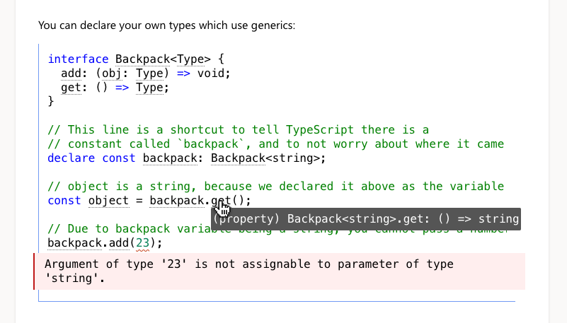

### gatsby-remark-shiki-twoslash

Sets up markdown code blocks to run through [shiki](https://shiki.matsu.io) which means it gets the VS Code quality
syntax highlighting. This part is basically the same as [gatsby-remark-shiki](https://www.gatsbyjs.org/packages/gatsby-remark-shiki/).

This module adds opt-in [@typescript/twoslash](https://github.com/microsoft/TypeScript-Website/tree/v2/packages/ts-twoslasher)
rendering for TypeScript code blocks.

It's what powers the code samples on the TypeScript website.



With a bit of work you can explain complicated code in a way that lets people introspect at their own pace.

## Plugin Setup

1. **Install the dependency**: `yarn add --dev gatsby-remark-shiki-twoslash`
1. **Include `"gatsby-remark-shiki-twoslash"` in the plugins section** of `gatsby-transformer-remark`

   ```diff
   {
     resolve: `gatsby-transformer-remark`,
     options: {
       plugins: [
         "gatsby-remark-autolink-headers",
   +       {
   +         resolve: ""gatsby-remark-shiki-twoslash",
   +         options: {
   +            theme: "nord",
   +         }
   +       },
         "gatsby-remark-copy-linked-files",
         "gatsby-remark-smartypants",
       ],
     },
   }
   ```

   If you have `gatsby-remark-prismjs` still in delete it.

1. **Add the CSS**

   This CSS comes from the [TypeScript website's scss](https://github.com/microsoft/TypeScript-website/blob/v2/packages/typescriptlang-org/src/templates/markdown-twoslash.scss)

   You should consider it a base to work from, rather than a perfect for every project reference.

   ```css
   pre {
     color: black;
     background-color: white;
     padding: 12px;
     border-left: 1px solid #999;
     border-bottom: 1px solid #999;
     line-height: 20px;
     margin-bottom: 3rem;
     overflow: auto;
     position: relative;
   }
   pre.shiki {
     overflow: initial;
   }
   pre.twoslash {
     border-color: #719af4;
   }
   pre .code-container {
     overflow: auto;
   }
   pre code {
     white-space: pre;
     -webkit-overflow-scrolling: touch;
   }
   pre data-err {
     background: url("data:image/svg+xml,%3Csvg%20xmlns%3D'http%3A%2F%2Fwww.w3.   org%2F2000%2Fsvg'%20viewBox%3D'0%200%206%203'%20enable-background%3D'new%200%200%206%203'%20height%3D'3'%20width%3D'6'%3E%3Cg%20fill%3D'%23c94824'%3E%3Cpolygon%20points%3D'5.   5%2C0%202.5%2C3%201.1%2C3%204.1%2C0'%2F%3E%3Cpolygon%20points%3D'4%2C0%206%2C2%206%2C0.6%205.4%2C0'%2F%3E%3Cpolygon%20points%3D'0%2C2%201%2C3%202.4%2C3%200%2C0.   6'%2F%3E%3C%2Fg%3E%3C%2Fsvg%3E")
       repeat-x bottom left;
     padding-bottom: 3px;
   }
   pre .error,
   pre .error-behind {
     margin-left: -20px;
     margin-right: -12px;
     margin-top: 4px;
     margin-bottom: 4px;
     padding: 6px;
     padding-left: 14px;
     white-space: pre-wrap;
     display: block;
   }
   pre .error {
     position: absolute;
     background-color: #fee;
     border-left: 2px solid #bf1818;
     width: 100%;
     display: flex;
     align-items: center;
     color: black;
   }
   pre .error-behind {
     user-select: none;
     color: #fee;
   }
   data-lsp {
     border-bottom: 1px dotted transparent;
     transition-timing-function: ease;
     transition: border-color 0.3s;
   }
   @media (prefers-reduced-motion: reduce) {
     data-lsp {
       transition: none;
     }
   }

   pre:hover data-lsp {
     border-color: #747474;
   }

   .hover-info {
     background-color: #555;
     color: #fff;
     text-align: left;
     padding: 5px 2px;
     border-radius: 2px;
     font-family: Menlo, Monaco, Consolas, Courier New, monospace;
     white-space: pre-wrap;
   }
   #mouse-hover-info {
     position: absolute;
     z-index: 1;
   }
   ```

1. **Add the JS** for hover info to your component:

   ```jsx
   import React, { useEffect } from "react"
   import { setupTwoslashHovers } from "gatsby-remark-shiki-twoslash/dom";

   export default () => {
     // Add a the hovers
     useEffect(setupTwoslashHovers, [])

       // Normal JSX
     return </>
   }
   ```

### Verify

With that set up, start up your server and add a codeblock to a markdown file to see if it renders with highlights:

<pre>```json
{ "json": true }
```</pre>

If that works, then add a twoslash example:

<pre>```ts twoslash
interface IdLabel {id: number, /* some fields */ }
interface NameLabel {name: string, /* other fields */ }
type NameOrId<T extends number | string> = T extends number ? IdLabel : NameLabel;
// This comment should not be included

// ---cut---
function createLabel<T extends number | string>(idOrName: T): NameOrId<T> {
  throw "unimplemented"
}

let a = createLabel("typescript");`
```</pre>

If the code sample shows as

```ts
function createLabel<T extends number | string>(idOrName: T): NameOrId<T> {
  throw 'unimplemented'
}

let a = createLabel('typescript')
```

Then it worked, and you should be able to hover over `createLabel` to see it's types.
